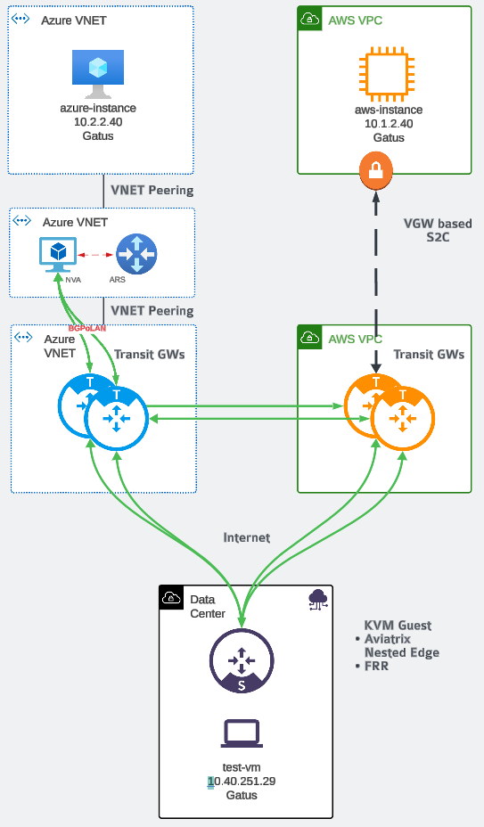
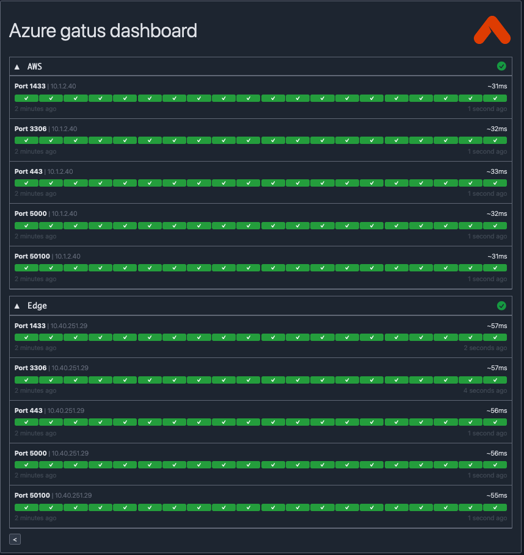

# Aviatrix Secure Hybrid Cloud Demo

## Infrastructure Overview

This Terraform module deploys deploys an application VNET/VPC and [Gatus](https://gatus.io/) test instance in three clouds - `AWS`, `Azure`, and `GCP`. Each gatus instance is attempting to communicate to the other 2 over various ports. An Aviatrix transit backbone is deployed across `AWS` and `Azure`. Connectivity between the backbone and the application VNET/VPC is achieved by:

- `AWS` - BGP connection between an `AWS` Aviatrix transit gateway and `AWS` customer gateway via site-to-cloud vpn.
- `Azure` - BGP connection between Azure route server and the `Azure` Aviatrix transit gateway with an NVA (network virtual appliance) propagating the spoke cidr to ARS.
- `GCP` - Aviatrix Edge

### Topology

The following depicts the topology deployed.



### Goal

The goal of this infrastructure is to demo the use-case of secure hybrid cloud connectivity.

## Requirements

Before deploying this infrastructure, ensure that you meet the following requirements:

### Aviatrix Platform

Aviatrix Controller and Copilot instances deployed and configured with cloud accounts for `AWS` and `Azure`.

### Cloud Accounts

The following CSP accounts are required.

- AWS account
- Azure subscription
- GCP Project

### Edge

- **QCOW2 File**: A QCOW2 disk image file is required for the KVM guest deployed in the GCP VPC. Ensure you have this file in the same folder as your terraform configuration before starting the deployment.

### Terraform

- **Terraform Version 1.5.0 or later**: This module requires Terraform 1.5.0 or higher. You can install the latest version from the official Terraform website [here](https://www.terraform.io/downloads.html).

## Example terraform code

See [example terraform](example). You may need to modify the csp providers to match the method used for authentication and account/subscription/project selection for each cloud.

## Outputs

The result of the terraform apply is a set of outputs with the URL for each gatus instance.

```terraform
gatus_dashboard_urls = {
  "aws" = "http://3.87.211.150"
  "azure" = "http://40.77.42.240"
  "edge" = "http://34.118.249.233"
}
```

## Gatus Dashboards

Each gatus dashboard for a particular cloud depicts the real-time connectivity to the other 2 clouds. For example, the `Azure` dashboard would show depict connectivity to `AWS` and `Edge`.


